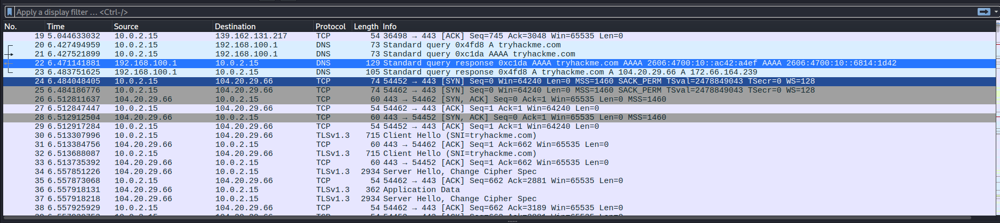

Speksit

CPU: AMD ryzen 7600x 

GPU: AMD radeon 9060 XT 

RAM: 32 GB 

OS: Windows 10 pro

   x) Lue ja tiivistä. (Tässä x-alakohdassa ei tarvitse tehdä testejä tietokoneella, vain lukeminen tai kuunteleminen ja tiivistelmä riittää. Tiivistämiseen riittää muutama ranskalainen viiva.)
        Karvinen 2025: Wireshark - Getting Started
         - asennus:  sudo apt-get install wireshark, wiresharkin käynnistettyä siitä voi valita mikä eri verkkolaitteiden liikennettä seuraa
         - Liikennettä voi suodattaa: näyttää vain tietyn protokollan tai poistaa sen näkymästä, liikennettä voi tallettaa tiedostoina muodossa .pcap
        
Karvinen 2025: Network Interface Names on Linux

en: Ethernet yhteys
wl: wifi (langaton)
lo: omalta koneelta sen sisälle (loopback)

Artikkeliss mainitaan myös yleisimpiä nimiä, lisäyksenä enx jälkeinen numerosarja on mac-osoite

omat liitännät voi tarkistaa komennoilla

      ip a
      ip route

        
   a) Linux. Asenna Debian tai Kali Linux virtuaalikoneeseen. (Tätä alakohtaa ei poikkeuksellisesti tarvitse raportoida, jos sinulla ei ole mitään ongelmia. Jos on mitään haasteita, tee täsmällinen raportti)

   
   Minulla oli jo aikaisemmalta kurssilta asennettu kali linux virtuaalikone

   VM: Oracle Virtualbox Kali Linux

   Base memory: 4096 mb 
   Prosessors: 2 
   Storage: 30 GB
   
   b) Ei voi kalastaa. Osoita, että pystyt katkaisemaan ja palauttamaan virtuaalikoneen Internet-yhteyden.

   
   Netin katkaisu

   
   

   Testasin pingaamalla 8.8.8.8 joka on Googlen DNS palvelin

   
   
   

   Yhdistin takaisin "Wired connection 1" ja pingasin uudestaan 

   

   

   Ja netti on takaisin ylhäällä.

   
  c) Wireshark. Asenna Wireshark. Sieppaa liikennettä Wiresharkilla. (Vain omaa liikennettäsi. Voit käyttää tähän esimerkiksi virtuaalikonetta).

   Kali Linuxissa on jo valmiiksi asennettu wireshark sen saa auki etsimällä sen ja klikkaamalla sen auki tai vain kirjoittamalla terminaaliin

         wireshark

  Avattuani pääseen tähän valikkoon, siitä voi valita mitä liikennettä haluaa tarkastella.

   

  

  Valitsin eth0 , koska virtuaalikone käyttää langallista yhteyttä
  

  Tällä hetkellä ei ole mitään liikennettä, joten aloin luomaan sitä 

  Menin sivulle tryhackme.com 

   

   Wireshark alkoi sieppaamaan liikenettä kun olin matkalla sivulle

   
   
  
  d) Oikeesti TCP/IP. Osoita TCP/IP-mallin neljä kerrosta yhdestä siepatusta paketista. Voit selityksen tueksi laatikoida ne ruutukaappauksesta. (Voit käyttää 
  vastauksesi osana ruutukaappaustasi h0-tehtävästä, mutta tässä tehtävässä tarvitaan myös sanallinen selitys.)

   
   

   

1. Application: DNS
2. transport: UDP
3. internet: IPv4
4. link: Ethernet 2
   
  e) Mitäs tuli surffattua? Avaa surfing-secure.pcap. Tutustu siihen pintapuolisesti ja kuvaile, millainen kaappaus on kyseessä. Tässä siis vain lyhyesti ja yleisellä tasolla. Voit esimerkiksi vilkaista, montako konetta näkyy, mitä protokollia pistää silmään. Määrästä voit arvioida esimerkiksi pakettien lukumäärää, kaappauksen kokoa ja kestoa.

  Latasin .pcap tiedoston https://terokarvinen.com/verkkoon-tunkeutuminen-ja-tiedustelu/surfing-secure.pcap

  Avasin sen wiresharkilla kohdasta File &rarr; Open 

   

   Sieppauksessa on 283 pakettia, pakettien järjestystä voi suodattaa painamalla No. kohdasta

   

   Protokollia on muutama: ARP, DNS, QUIC, TCP ja TLS 1.3

   Koneiden määrät voi päätellä IP-osoitteiden määrästä, uniikkeja osoitteita on 6 

   Vain yksi on yksityinen 192.168.122.7

   Sieppaaminen alkoi 17.28.09 ja loppui 17.28.16 eli lyhyt sessio n. 7 sekuntia

 
  
  f) Vapaaehtoinen, vaikea: Mitä selainta käyttäjä käyttää? surfing-secure.pcap (Päivitys 2025-03-31 w14 ma - muutin tehtävän vapaaehtoiseksi Giang:n suosituksesta)
  
  g) Minkä merkkinen verkkokortti käyttäjällä on? surfing-secure.pcap

   Näytönohjain on realtek

   Se löytyy kohdasta ethernet 2, koska se on fyysisellä tasolla koneen kanssa tekemisessä eli link layerillä

   
  
   h) Millä weppipalvelimella käyttäjä on surffaillut? surfing-secure.pcap
        Huonoja uutisia: yhteys on suojattu TLS-salauksella.

   Tiedän aikaisemmilta kursseilta että DNS  muuttaa verkkosivujen nimet  ip-osoitteiksi joten lähdin siitä liikkeelle 

 

 Siellä oli tuttuja sivujen kuten google.com ja terokarvinen.com
https://terokarvinen.goatcounter.com/help/visitor-counter 

Kävin katsomassa tuon oudon gc.zgo.at/

 

 Se oli välikäsi goatcounterille ja viimeinenkin DNS kysely oli sivulle terokarvinen.goatcounter.com

 Tutkin lisää goatcounteria (Menin sen [kotisivulle](https://www.goatcounter.com/) ) ja se on avoimen lähdekoodin sivusto analytiikkaa. 

 Eli todennäköisemmin tässä käytiin terokarvinen.com:ssa joka lähetti tiedon eteenpäin goatcounterille joka mm. pitää kirjaa kuinka monta kävijää sivulla on samaan aikaan (kts. https://terokarvinen.goatcounter.com/help/visitor-counter)  

 

        
  i) Analyysi. Sieppaa pieni määrä omaa liikennettäsi. Analysoi se, eli selitä mahdollisimman perusteellisesti, mitä tapahtuu. (Tässä pääpaino on siis analyysillä ja selityksellä, joten liikennettä kannattaa ottaa tarkasteluun todella vähän - vaikka vain pari pakettia. Gurut huomio: Selitä myös mielestäsi yksinkertaiset asiat.)

  Avasin uuden wireshark ikkunan ja valitsin eth0

  
   

Otin tästä kaappauksesta paketit 401-404

Tässä tapauksessa sama perus DNS kysely toistetaan IPv6 ja IPv4, koska hs.fi tukee IPv6:sta

Paketti 401

lähde: 10.0.2.15 (minun vm)

Kohde: 192.168.100.1 (Minun DNS palvelin)

Protokolla: DNS (UDP)

Kysely IPv4 osoite kohteelle www.hs.fi

Paketti 402:

Sama prosessi mutta AAAA eli IPv6 

lähde:
Source: 10.0.2.15 (minun vm)

Kohde: 192.168.100.1 (Minun DNS palvelin)

Protokolla: DNS (UDP)

Lähde: 10.0.2.15 (minun vm)

Kohde: 192.168.100.1 (Minun DNS palvelin)

Protokolla: DNS (UDP)
Kysely IPv6 osoite kohteelle www.hs.fi

Paketti 403

DNS palvelin vastaa minun vm:lle

Lähde: 192.168.100.1 (DNS palvelin)

Kohde: 10.0.2.15 (Minun vm)

Protokolla: DNS

Se vastaa kohteelle 0x11b0 (paketti 401)

Se löysi aliaksen (CNAME)  www.hs.fi:  www-hs-fi.prod.sanoma-sndp.fi

Ja monta eri ip-osoitetta:

3.164.68.107

3.164.68.82

3.164.68.3

HS:llä on monta eri ip-osoitetta, koska siellä voi olla paljon ruuhkaa, näin se voidaan tasapainottaa niiden välillä

Paketti 404

DNS palvelin vastaa minun vm:lle

Lähde: 192.168.100.1 (DNS palvelin)

Kohde: 10.0.2.15 (Minun vm)

Protokolla: DNS

Se vastaa kohteelle 0xbbb3 (paketti 402):

Se löysi aliaksen (CNAME)  www.hs.fi:  www-hs-fi.prod.sanoma-sndp.fi

Ja löysi ainakin yhden IPv6-osoitteen:
 
2600:9000:278c:ca00:10:3b34:7000:93a1:

## Lähteet

https://terokarvinen.com 

https://terokarvinen.com/verkkoon-tunkeutuminen-ja-tiedustelu/ 

https://tryhackme.com

https://terokarvinen.com/verkkoon-tunkeutuminen-ja-tiedustelu/surfing-secure.pcap

https://www.goatcounter.com/

https://terokarvinen.goatcounter.com/help/visitor-counter
