Speksit

CPU: AMD ryzen 7600x

GPU: AMD radeon 9060 XT

RAM: 32 GB

OS: Windows 10 pro

VM: Oracle Virtualbox Kali Linux

Base memory: 4096 mb

Prosessors: 2 

Storage: 30 GB
 
 
 
 # x) Lue ja vastaa lyhyesti kysymyksiin. Tässä alakohdassa x ei tällä kertaa tarvitse lukea artikkeleita kokonaan, ei tarvitse tiivistää niitä, eikä tehdä testejä koneella.
   Selitä tuskan pyramidin idea 1-2 virkkeellä. Bianco 2013: Pyramid of Pain. (Katso eritoten pyramidin kuvaa.)
  Selitä timanttimallin (Diamond Model) idea 1-2 virkkeellä. Tekijä esittelee sen aika juhlallisesti, voit myös etsiä yksinkertaisempia artikkeleita hakukoneella tai kelata suoraan timantin kuvaan. Caltagirone et al 2013: Diamond Model

Tuskan pyramidi 

- Tuskan pyramidi kuvaa mallia kyberhyökkääjään taktiikkojen ja strategioiden lamauttaumisesta
- Mitä korkeammalla pyramidia se on niin sitä epäkätevämpää se on hyökkääjälle esim. ip-osoitteen estäminen vähän epäkätevää, hyökkääjään työkalun estäminen/lamauttaminen erittäin epäkätevää
[Lähde 3]( https://detect-respond.blogspot.com/2013/03/the-pyramid-of-pain.html).

Timanttimalli

Löysin googlehaulla vähän helposti sulatettavissa olevan selityksen [Lähde 4](https://kravensecurity.com/diamond-model-analysis/).

- Mallissa timantti muodostuu vastustajan(adversary) ja uhrin (victim) välillä, ne linkittyvät infrastructure (mitä kautta hyökkäys levisi) ja capability (mitä keinoja hyökkääjä käytti) kautta
- Timanttimalli on yksi lukuisista malleista, jolla voidaan analysoida oppia kyberhyökkäysten kulkua
[Lähde 4](https://kravensecurity.com/diamond-model-analysis/).

 # a) Apache log. Asenna Apache-weppipalvelin paikalliselle virtuaalikoneellesi. Surffaa palvelimellesi salaamattomalla HTTP-yhteydellä, http://localhost . Etsi omaa sivulataustasi vastaava lokirivi. Analysoi yksi tällainen lokirivi, eli selitä sen kaikki kohdat. (Jos Apache ei ole kovin tuttu, voit tätä tehtävää varten vain asentaa sen ja testata oletusweppisivulla. Eli ei tarvitse tehdä omia kotisvuja tms.)

 Minulla on vahva epäilys, että Kali Linuxissa on valmiiksi asennettu Apache2, joten tarkistin sen komennolla 

    sudo systemctl status apache2

  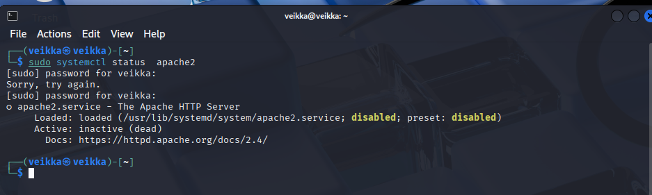

  Sehän oli, mutta se ei ollut päällä joten käynnistin sen 

    sudo systemctl start apache2

   Olen käyttänyt Apache2 aikaisemmin Linux-palvelimet kurssilla, joten päätin kertauksen vuoksi tehdä oman nettisivun

 Hakemiston luonti 

      sudo mkdir -p /var/www/minunsivu/public_html

Sivun luonti 

    sudo micro /var/www/minunsivu/public_html/index.html

   HTML teksti

  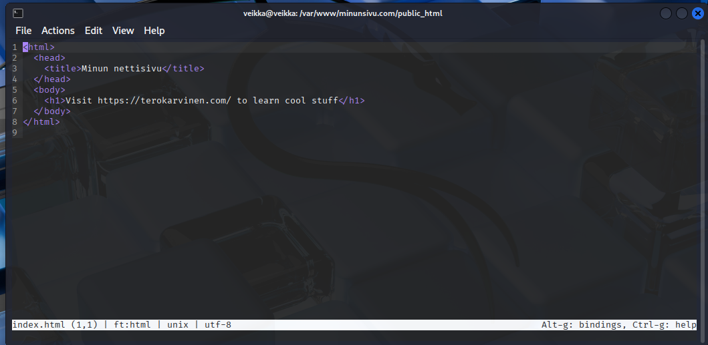

   Tässä vaiheessa jouduin katsomaan apua netistä, löysin napakan tutoriaalin siitä [Lähde 5](https://www.veeble.com/kb/how-to-setup-apache-to-host-a-website-in-linux/). 
   Minun pitää lisätä tarvittavat asiat conf tiedostoon

    micro  /etc/apache2/sites-available/minunsivu.com.conf

   Ja  muokaten minunsivu.com kohtiin

  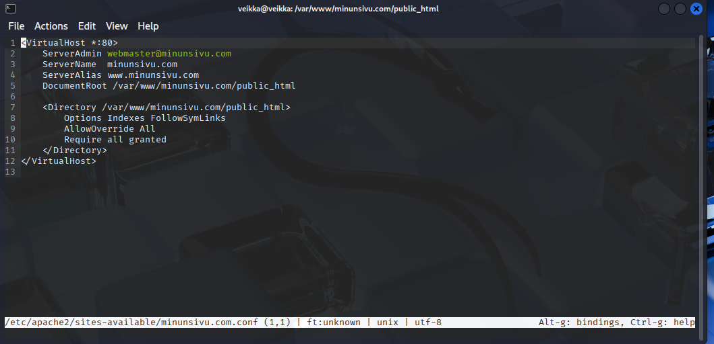

Se pitää vielä  pistää päälle komennolla 

    sudo a2ensite minunsivu.com.conf

Sitten menin minunsivu.com ja..

  

 Se on pystyssä

 Tämä oli itselleni hyvää kertausta, koska siitä on melkein vuosi kun olin viimeksi käyttänyt Apache2:sta 

 Nyt sitten itse asiaan: Tehtävän vinkeissä oli komento 

    sudo tail -F /var/log/apache2/access.log

 Joten vaihdoin sen omalleni nettisivulleni

 
    sudo tail -F /var/log/minunsivu.com/access.log

  Suljin  omat apachesivut 

  Testasin ensiksi curlilla, koska halusin nähdä miltä se näyttää lokeissa ja menin tietenkin myös ihan selaimen kautta sivuille 

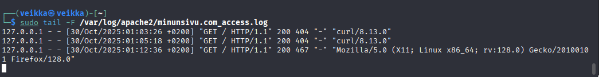

127.0.0.1: Nettisivulle menijän IP-osoite (tässä tapauksessa tietenkin minä eli localhost)

Seuraavaksi on päivämäärä, kellonaika, aikavyöhyke aika yksiselitteistä

"GET / HTTP/ 1.1": GET-tyyppinen  HTTP pyyntö eli nimensä mukaan pyytää tietoa, HTTP protokolla versio 1.1

200: HTTP:n statuskoodi, tarkoittaa, että kaikki meni hyvin

404/467: pyynnön koko tavuina (selain vs curl yllättävän vähän koko eroa)

"-": Referointi kenttä, näyttää jos käyttäjä on tullut jostain toisesta paikasta/nettisivulta tälle sivulle [lähde](https://stackoverflow.com/questions/9234699/understanding-apaches-access-log)

"Mozilla/5.0 (X11; Linux x86_64; rv:128.0) Gecko/20100101 Firefox/128.0"/ "curl/8.13": näyttää miten käyttäjä on päässyt sivulle(User agent), tässä firefox ja curl (uusin curl versio on 8.16 kali näköjään käyttää vanhempaa versiota)
  

  

 
 # b) Nmapped. Porttiskannaa oma weppipalvelimesi käyttäen localhost-osoitetta ja 'nmap -A' päällä. Selitä tulokset. (Pelkkä http-portti 80/tcp riittää)

Kalissa on nmap asennettu valmiina

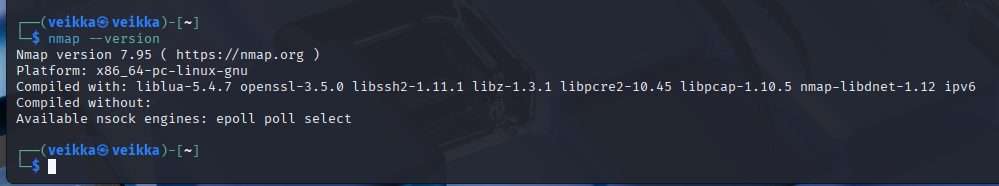

Ennen kuin aloitin porttiskannailemaan, irrotin virtuaalikoneeni netistä

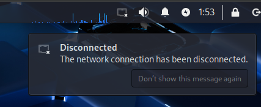

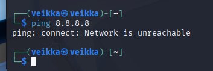

Tästä eteenpäin kun tein tehtäviä netti pysyi poissa päältä ellen erikseen maininnut asiasta.

 Oman nettisivun porttiskannaus käyttäen localhost-osoitetta tehdään komennolla

    sudo nmap -T4 -vv -A -p 80 localhost

 Kun alan skannaamaan portteja haluan täsmälleen tietää mitä olen tekemässä, koska nautin elämästä vapaanan miehenä.

 Onneksi on man sivut joten tarkastin kaikki flagit sieltä komennolla 

    man nmap

 

 sudo: komento suoritetaan korkeimmilla oikeuksilla eli root
 
 nmap: mitä sovellusta käytetään
 
 -T4: skannauksen nopeus (0 hitain 5 nopein)
 vv: verbose näyttää ja selittää tarkemmin mitä nmap tekee
 -A: aggressiivinen skannaus, koittaa selvittää paljon muutakin kuten käyttöjärjestelmän version esim ilman sitä

    sudo nmap -T4 -vv -p 80 localhost

 skannaisi pelkän portin

 -p 80: skannaa parametrien sisällä olevat portit eli portti 80

 localhost: kohde

 Itse komennon ajo

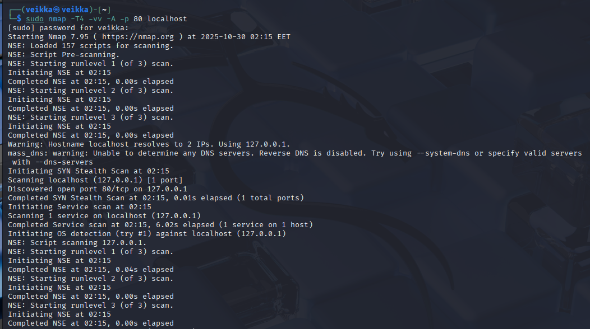

Tulos:

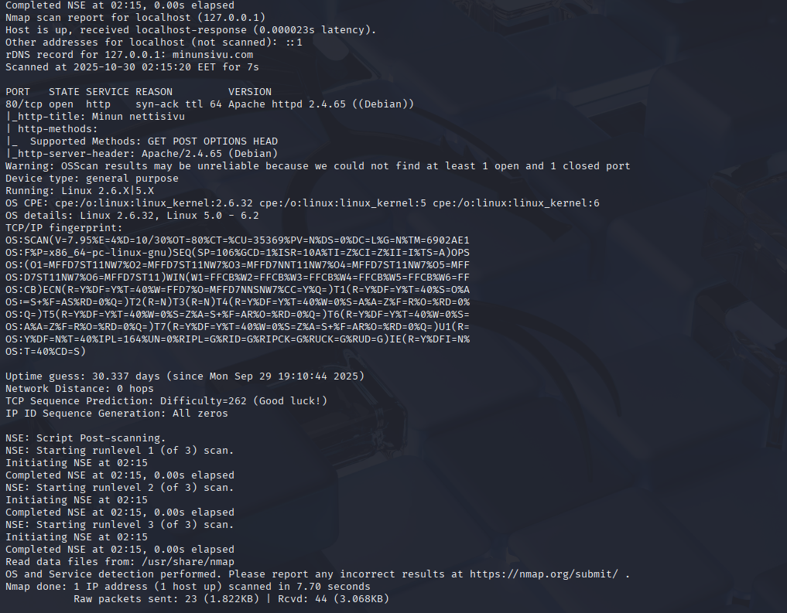

PORT   STATE SERVICE REASON         VERSION
80/tcp open  http    syn-ack ttl 64 Apache httpd 2.4.65 ((Debian))

-Avoin portti 80(http) Debianialla pyörivä Apache 2.4.65

|_http-title: Minun nettisivu

-Nettisivun HTML-koodin <title> 

| http-methods:
|_  Supported Methods: GET POST OPTIONS HEAD

-Palvelin vastaa GET POST OPTIONS HEAD pyyntöihin

http-server-header: Apache/2.4.65 (Debian)

-Palauttaa server headerin oli mitä palvelinta käytin

Warning: OSScan results may be unreliable because we could not find at least 1 open and 1 closed port
Running: Linux 2.6.X|5.X
OS details: Linux 2.6.32, Linux 5.0 - 6.2

-Nmapin paras arvaus käyttöjärjestelmästä

Network Distance: 0 hops

-Yhteys ei hyppinyt minkään reitittimen tai kytkimien välillä, koska skannaus oli oma kone

Nmap done: 1 IP address (1 host up) scanned in 7.70 seconds
           Raw packets sent: 23 (1.822KB) | Rcvd: 44 (3.068KB)

-Skannasi yhden IP-osoitteen, joka oli ylhäällä 7.70 sekunnissa
-Nmap lähetti 23  ja sai 44 pakettia
           

 
 
 
 # c) Skriptit. Mitkä skriptit olivat automaattisesti päällä, kun käytit "-A" parametria? (Näkyy avoimien porttinumeroiden alta, http-blah, http-blöh...).

 Ajoin saman komennon ilman -A flagia

    sudo nmap -T4 -vv -p 80 localhost

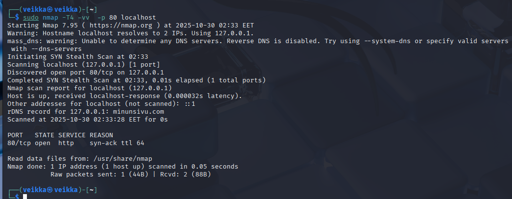

 Tulos oli paljon lyhyempi kuin -A kanssa, mutta skriptejä oli esimerkiksi

Selitetty ylhäällä 

http-title:
http-methods: 
http-server-header: Apache/2.4.65 (Debian):

Mukana oli myös käyttöjärjestelmän tunnistusta ja monen monta muuta NSE-skriptiä
 
 
 # d) Jäljet lokissa. Etsi weppipalvelimen lokeista jäljet porttiskannauksesta (NSE eli Nmap Scripting Engine -skripteistä skannauksessa). Löydätkö sanan "nmap" isolla tai pienellä? Selitä osumat. Millaisilla hauilla tai säännöillä voisit tunnistaa porttiskannauksen jostain muusta lokista, jos se on niin laaja, että et pysty lukemaan itse kaikkia rivejä?

Ajoin uudestaan

    sudo nmap -T4 -vv -p 80 localhost

 Menin katsomaan lokeja uudestaan 

 
    sudo tail -F /var/log/apache2/minunsivu.com_access.log

  

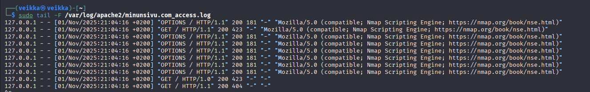

Siinä näkyy kyseinen porttiskannaus, se on helppo löytää koska siellä ei ole paljon liikennettä.

Onneksi Linuxissa on grep komento, jolla voi suodattaa tietoa helposti 

    sudo grep -i "nmap" /var/log/apache2/minunsivu.com_access.log

 grepin i-parametri tekee hausta ei- case sensitive eli tulostaa sanan "nmap", ei väliä onko isolla tai pienellä kirjaimella

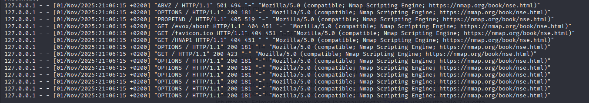

Porttiskannaus lähetti monta pyyntöä palvelimelle ja grepillä näkyi paljon monta eri pyyntöä kuin mitä pelkässä lokissa näkyi

127.0.0.1: Nettisivulle menijän IP-osoite (tässä tapauksessa tietenkin minä eli localhost)

Seuraavaksi on päivämäärä, kellonaika, aikavyöhyke aika yksiselitteistä

Ensimmäinen numero on status koodi ja jälkimmäinen koko tavuina eli 

OPTIONS / HTTP/1.1" 200 

Kysyy mitä HTTP metodeja tukee, 200 koodi: kaikki OK

"PROPFIND / HTTP/1.1" 405 

Käytetään tiedostojen metadataa hakemiseen, koodi 405: ei salli (mutta tunnistaa sen)

Pyysi GET:llä yleisempiä nettisivun elementtejä esim. favicon on ikoni, jonka voi määrittää nettisivulle., koodi 404: ei löytynyt

"-": Referointi kenttä, näyttää jos käyttäjä on tullut jostain toisesta paikasta/nettisivulta tälle sivulle [lähde](https://stackoverflow.com/questions/9234699/understanding-apaches-access-log), samoin kuin kohdassa a

Mozilla/5.0 (compatible; Nmap Scripting Engine; https://nmap.org/book/nse.html)

Mistä pyyntö on tullut (user agent), tunnisti että se on tullut Nmapin Scripting Engine (NSE)

 
 # e) Wire sharking. Sieppaa verkkoliikenne porttiskannatessa Wiresharkilla. Huomaa, että localhost käyttää "Loopback adapter" eli "lo". Tallenna pcap. Etsi kohdat, joilla on sana "nmap" ja kommentoi niitä. Jokaisen paketin jokaista kohtaa ei tarvitse analysoida, yleisempi tarkastelu riittää.

Käynnistin wiresharkin komennolla

    wireshark

 Valitsin sieppauskohteeksi Loopback adapter: lo kuten tehtävänannossa neuvotaan

 Menin uudestaan localhost-sivulle (minunsivu.com) ja ajoin jälleen 

     sudo nmap -T4 -vv -p 80 localhost

Paketteja alkoi tulemaan, lopetin tallennuksen ja tallensin tiedoston

 
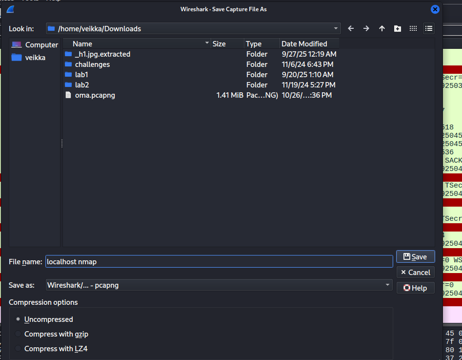

katsoin wiresharkin man sivuilta miten etsiä tiettyjä sanoja paketeista

 
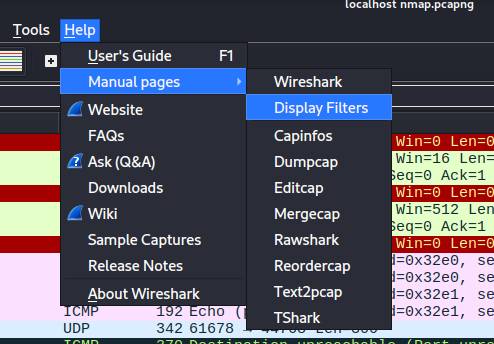

Syntaksi sille on frame contains "sana" eli tässä  [Lähde 7](https://www.wireshark.org/docs/man-pages/wireshark-filter.html).

    frame contains "nmap"

 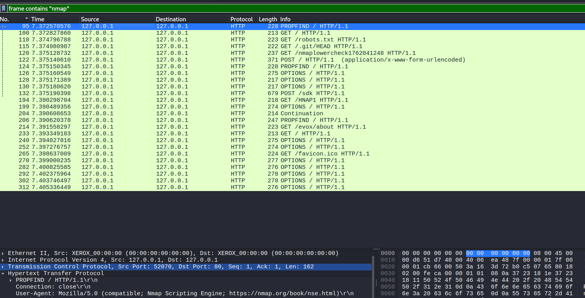

 Tutun näköisiä paketteja aikaisemmista kohdista samat GET, OPTIONS ja muut, kaikki jossa käytetään HTTP 1.1 lähteestä NSE
 
 # f) Net grep. Sieppaa verkkoliikenne 'ngrep' komennolla ja näytä kohdat, joissa on sana "nmap".

Kalissa on jälleen valmiiksi asennettu ngrep

 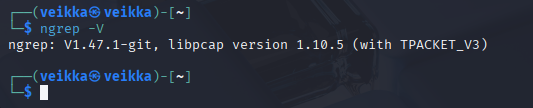

 

    sudo ngrep -d lo -i nmap

 ngrep on grep mutta verkkoliikenteen etsimiseen parametri -d määrittää kohteen(localhost) ja sama -i nmap eli etsii ei case sensitive nmap sanaa

 Ajoin 

    sudo ngrep -d lo -i nmap

 Sitten avasin uuden terminaali-ikkunan (shortcut sille ctrl+alt+t) ja suoritin porttiskannauksen uudestaan 

    sudo nmap -T4 -vv -p 80 localhost

   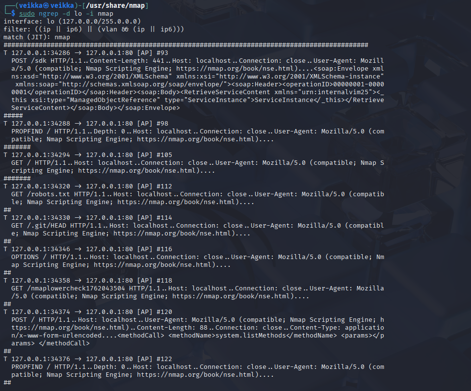

   
   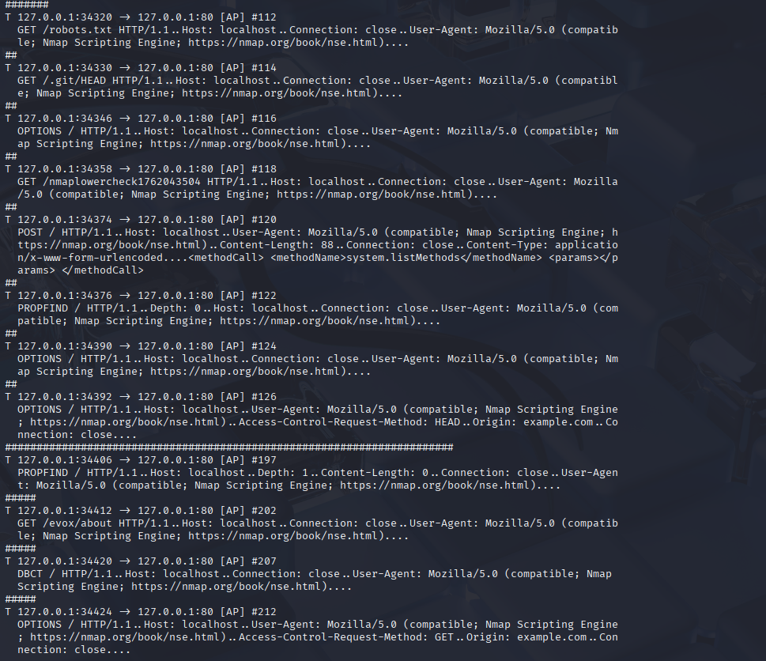

   Omaan silmään näyttäisi aika samalta kuin wireshark, siinä on varmasti paljon nuansseja jota en (vielä) ymmärrä.
   

 
 
 # g) Agentti. Vaihda nmap:n user-agent niin, että se näyttää tavalliselta weppiselaimelta.
 

Ensiksi tämä vaikutti aika korkeatason hommalta, mutta sitten muistin, että NSE oletus user agent on Mozilla/5.0. Menin nmap skriptit ja niiden  kirjasto sijaintiin  /usr/share/nmap/.

Sieltä etsin sanaa  Mozilla/5.0 komennolla 

    grep -ir "Mozilla/5.0"

  

  Sieltä löytyi scripts/http-useragent-tester.nse

  Menin sinne ja ihan testi mielessä vaihdoin Mozilla 5.0 Mozilla 4.0

  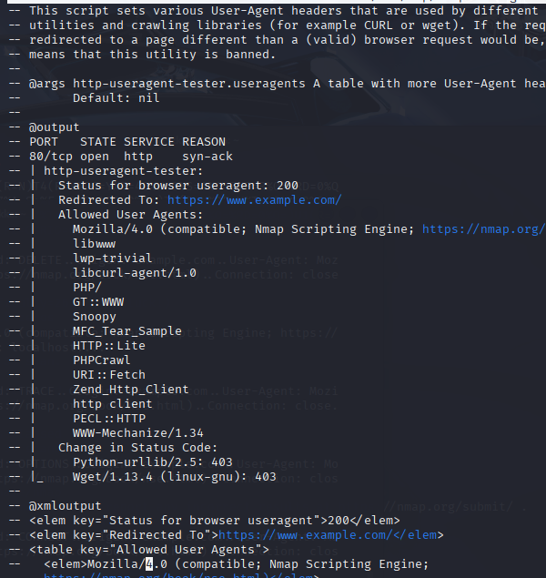

Porttiskannasin uudestaan 

      sudo ngrep -d lo -i nmap
      sudo nmap -T4 -vv -p 80 localhost

  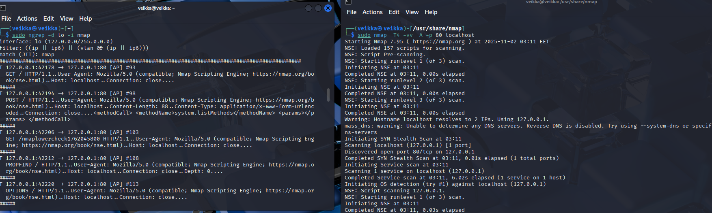

  Se oli vieläkin Mozilla 5.0. Asia oli vähän enemmänkin monimutkaisempi ja user agentti referoidaan monessa eri tiedostossa, joten katson Tero sivuilta apua. 
  
  Siellä oli Nmapin ala kohdassa --script-args http.useragent="BSD experimental on XBox350 alpha (emulated on Nokia 3110)" [Lähde 2](https://terokarvinen.com/verkkoon-tunkeutuminen-ja-tiedustelu/#h2-lempivari-violetti). 

  Se näyttäisi asettavan user agentin manuaalisesti, joten päätin kokeilla sitä ensin ennen kuin lähden muokkaamaan skriptejä liikaa. 

  Lisäsin sen aiemmin käytetyn nmap komennon loppuun eli 

      sudo nmap -T4 -vv -p 80 localhost --script-args http.useragent="BSD experimental on XBox350 alpha (emulated on Nokia 3110)"
  
  

 
 
 
 # h) Pienemmät jäljet. Porttiskannaa weppipalvelimesi uudelleen localhost-osoitteella. Tarkastele sekä Apachen lokia että siepattua verkkoliikennettä. Mikä on muuttunut, kun vaihdoit user-agent:n? Löytyykö lokista edelleen tekstijono "nmap"?

 Ajoin

    sudo nmap -T4 -vv -p 80 localhost --script-args http.useragent="BSD experimental on XBox350 alpha (emulated on Nokia 3110)"

  

  Nyt siellä oli vain yksi maininta Nmapista, jonka user agent on "BSD experimental on XBox350 alpha (emulated on Nokia 3110)"

Samoin apachelokeissa yksi ja sama kuin wiresharkissa 

  

 Tarkistin vielä lopuksi ngrepillä

    sudo ngrep -d lo -i nmap

 
  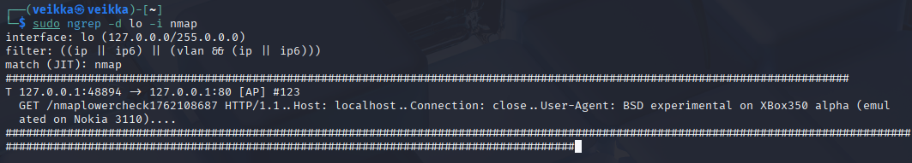

  Ja siellähän on sama GET  /nmaplowercheck1762108687
  

 
 # i) Hieman vaikeampi: LoWeR ChEcK. Poista skritiskannauksesta viimeinenkin "nmap" -teksti. Etsi löytämääsi tekstiä /usr/share/nmap -hakemistosta ja korvaa se toisella. Tee porttiskannaus ja tarkista, että "nmap" ei näy isolla eikä pienellä kirjoitettuna Apachen lokissa eikä siepatussa verkkoliikenteessä. (Tässä tehtävässä voit muokata suoraan lua-skriptejä /usr/share/nmap alta, 'sudoedit'. Muokatun version paketoiminen siis rajataan ulos tehtävästä.)

 Etsin hakemistosta  /usr/share/nmap/ tekstiä "nmaplowercheck"

    grep -ir "nmaplowercheck"

 
  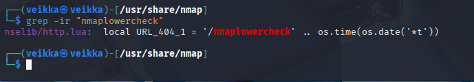

  Sieltä löytyi yksi maininta kohdassa nselib/http.lua joten menin editoimaan sitä

     sudoedit nselib/http.lua 

  Etsin ctrl+f:llä nmaplowercheck

  
  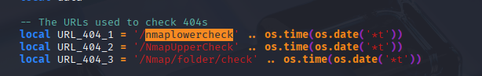

  Löytyi

Vaihdoin nimen Testaus123

 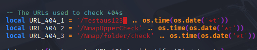

Tallensin ja poistuin. Ajoin porttiskannauksen uudestaan 

    sudo nmap -T4 -vv -p 80 localhost --script-args http.useragent="BSD experimental on XBox350 alpha (emulated on Nokia 3110)"

Kävin tarkastamassa 

ngrep

 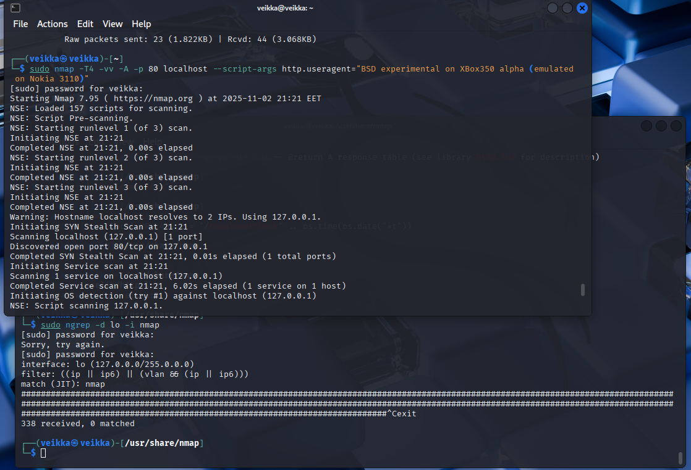

wireshark (Huom. aika 21:41 kun aloitin skannaamaan)

 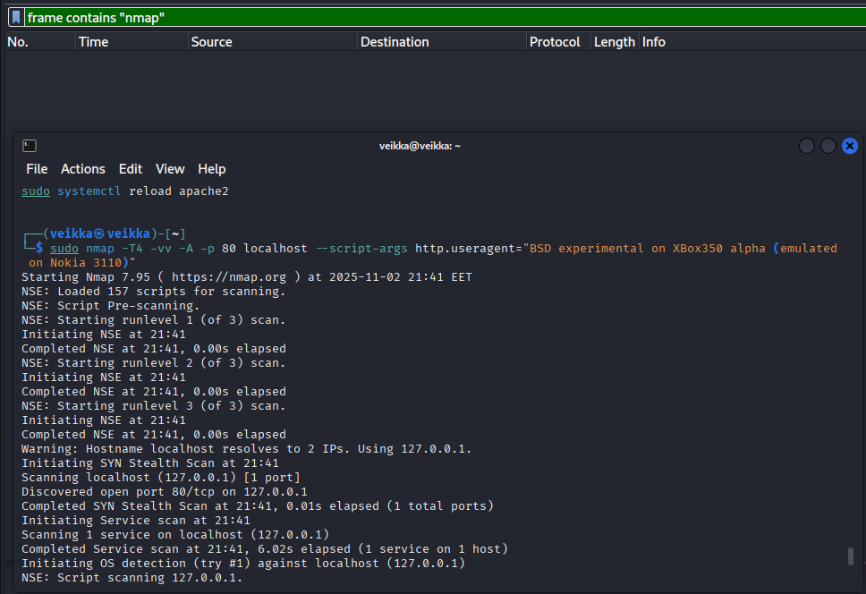

Ja viimeiseksi apache lokit (Viimeisin 20:38

 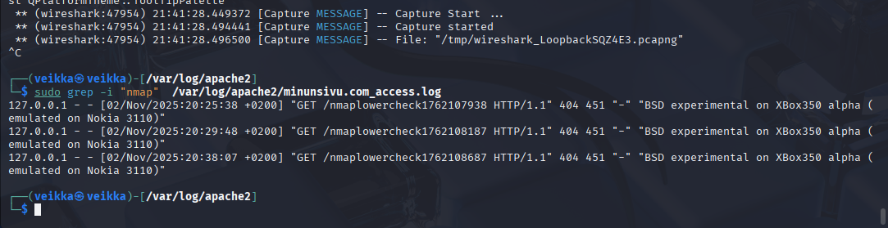

 Tämä jäi häiritsemään joten poistin lokit 

     sudo rm /var/log/apache2/*.log                                
     sudo systemctl restart apache2

 Aloitin uuden porttiskannauksen 21.51

      sudo nmap -T4 -vv -p 80 localhost --script-args http.useragent="BSD experimental on XBox350 alpha (emulated on Nokia 3110)"

  Ja vihdoin 

     sudo grep -i "nmap" /var/log/apache2/minunsivu.com_access.log

 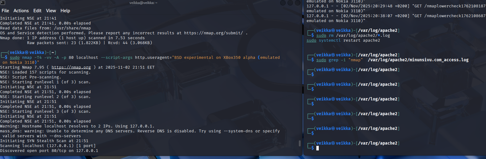

 Ei näy yhtään mainintaa Nmapista isolla tai pienellä

 Sieltä tietenkin löytyy teksti jolla nmap korvattiin (jos tietää mitä etsii).

 
 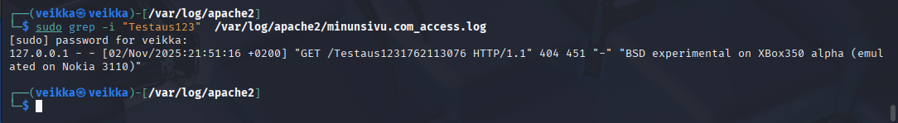
 

 ## Lähteet
1. https://terokarvinen.com
 
2. https://terokarvinen.com/verkkoon-tunkeutuminen-ja-tiedustelu/#h2-lempivari-violetti

3. https://detect-respond.blogspot.com/2013/03/the-pyramid-of-pain.html

4. https://kravensecurity.com/diamond-model-analysis/

5. https://www.veeble.com/kb/how-to-setup-apache-to-host-a-website-in-linux/

6. https://stackoverflow.com/questions/9234699/understanding-apaches-access-log

7. https://www.wireshark.org/docs/man-pages/wireshark-filter.html

 
