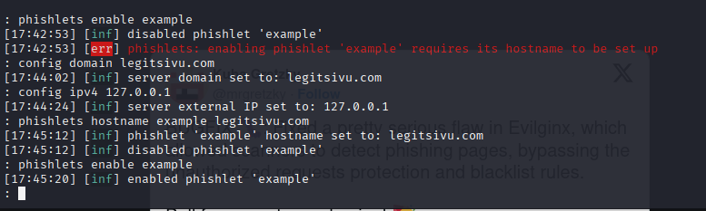
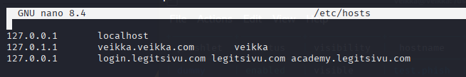
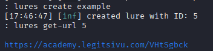
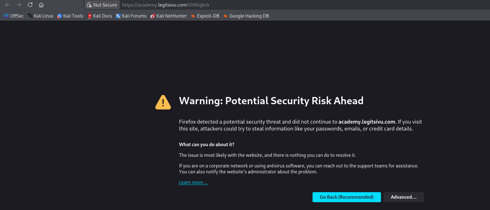
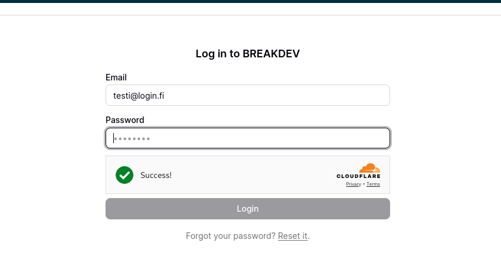

a) Tutustu seuraavaan työkaluun

  https://github.com/kgretzky/evilginx2
   Vastaa seuraaviin kysymyksiin
    Asensitko työkalun, jos asensit niin kirjoita miten sen teit.

    sudo apt install evilginx2

  tai 

    git clone https://github.com/kgretzky/evilginx2.git
    cd evilginx2
    make
    sudo make install

  Mitä teit työkalun kanssa?

Testaisin paikallisesti työkalua, loin flaskilla "legitsivu.com" nettisivun, josta voin evilginx:llä kaapata kuvitteellisen käyttäjän käyttäjänimen ja salasanan 

Menin evilginxiin

konffasin tarvittavat asetukset siellä

Menin muuttamaan localhostia, sinne pitää laittaa muutama eri 

Kommennoilla  

    lures create example
    lures get-url 5

tein linkin sivuille ja se tulosti sen linkin

Klikkasin linkistä 

ja menin varotuksista huolimatta 

Yritin kirjautua kuvitteelisilla tunnuksilla

En päässyt ja väitti, että väärä salasana tai sähköposti.

Sivu oli tietenkin huijaussivu ja sähköposti ja salasana oli tullut minulle 

  
  Onnistuitko huijaamaan liikennettä

  Kyllä, sain kalasteltua kuvitteellisen käyttäjän sähköpostin ja salasanan

b) Sinulla on käytössäsi mininet ympäristö. Luo ympäristö, jossa voit tehdä TCP SYN-Flood hyökkäyksen.

  Kirjoita miten loit mininet ympäristön ja miten toteutit hyökkäyksen.
