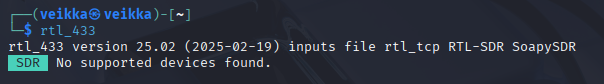
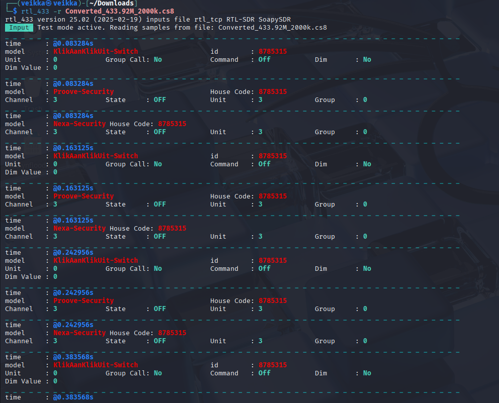
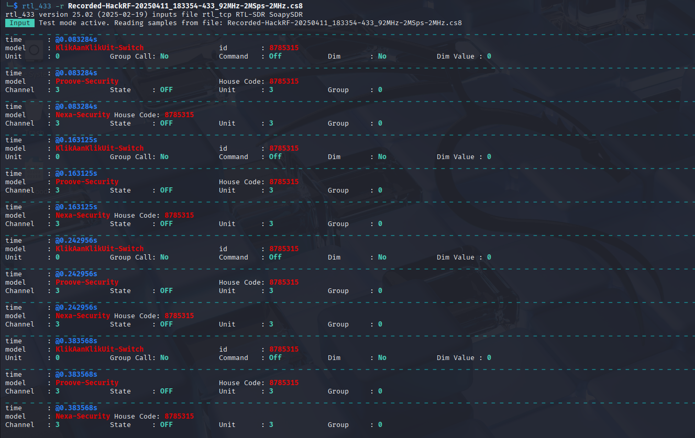
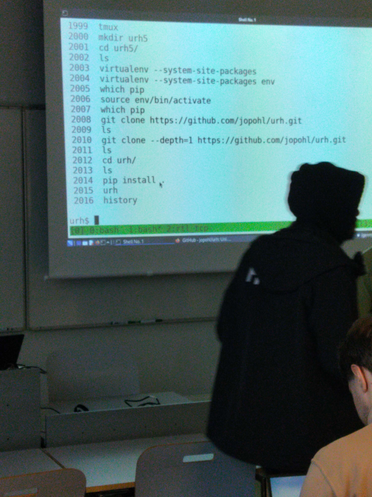
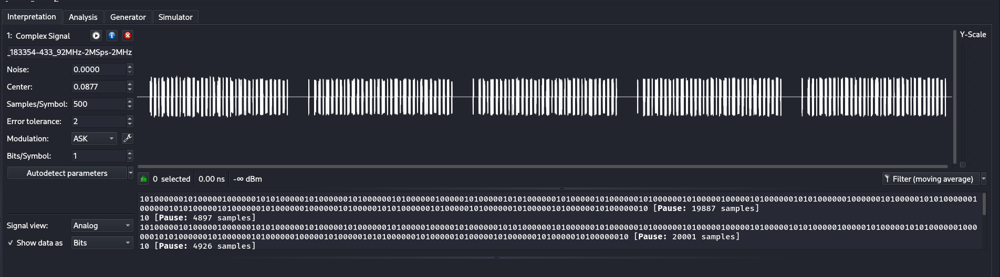
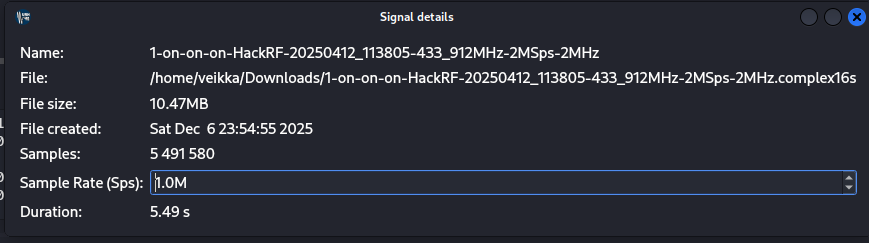
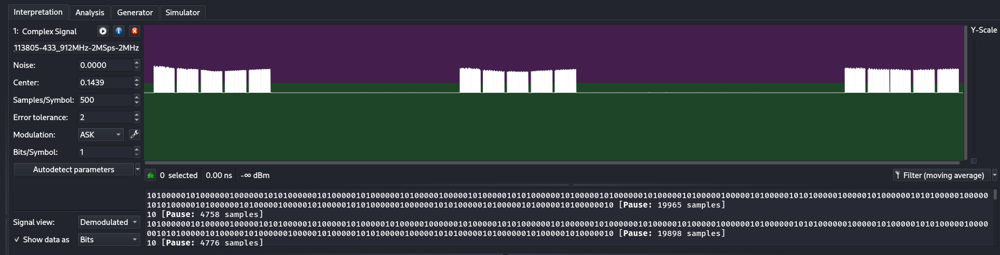

x) Lue ja tiivistä. (Tässä x-alakohdassa ei tarvitse tehdä testejä tietokoneella, vain lukeminen tai kuunteleminen ja tiivistelmä riittää. Tiivistämiseen riittää muutama ranskalainen viiva.)

  Hubacek 2019: Universal Radio Hacker SDR Tutorial on 433 MHz radio plugs (Video, alkaen 3:19 ja päättyen 7:40. Yhteensä noin 4 min.)
  
  Cornelius 2022: Decode 433.92 MHz weather station data
   

a) WebSDR. Etäkäytä WebSDR-ohjelmaradiota, joka on kaukana sinusta ja kuuntele radioliikennettä. Radioliikenne tulee siepata niin, että radiovastaanotin on joko eri maassa tai vähintään 400 km paikasta, jossa teet tätä tehtävää. Käytä esimerkkinä julkista, suurelle yleisölle tarkoitettua viestiä, esimerkiksi yleisradiolähetystä. Kerro löytämäsi taajuus, aallonpituus ja modulaatio. Kuvaile askeleet ja ota ruutukaappaus. (Tehtävässä ei saa ilmaista sellaisen viestin sisältöä tai olemassaoloa, joka ei ole tarkoitettu julkiseksi. Voit sen sijaan kuvailla, miten sait julkisen radiolähetyksen kuulumaan kaiuttimistasi. Julkisten, esimerkiksi yleisradiolähetysten sisältöä saa tietysti kuvailla.)

b) rtl_433. Asenna rtl_433 automaattista analyysia varten. Kokeile, että voit ajaa sitä. './rtl_433' vastaa "rtl_433 version 25.02 branch..."

    sudo apt-get install rtl_433

  

  

c) Automaattinen analyysi. Mitä tässä näytteessä tapahtuu? Mitä tunnisteita (id yms) löydät? Converted_433.92M_2000k.cs8. Analysoi näyte 'rtl_433' ohjelmalla.

Latasin tiedoston https://terokarvinen.com/verkkoon-tunkeutuminen-ja-tiedustelu/samples/Converted_433.92M_2000k.cs8

      rtl_433 -r Converted_433.92M_2000k.cs8

  

d) Too compex 16? Olet nauhoittanut näytteen 'urh' -ohjelmalla .complex16s-muodossa. Muunna näyte rtl_433-yhteensopivaan muotoon ja analysoi se. Näyte Recorded-HackRF-20250411_183354-433_92MHz-2MSps-2MHz.complex16s

Tiedosto piti muuttaa eri muotoon. Äskeisessä tehtävässä tiedosto muoto oli .cs8 ja se toimi joten muutin sen muotoon .cs8 komennolla

    mv Recorded-HackRF-20250411_183354-433_92MHz-2MSps-2MHz.complex16s Recorded-HackRF-20250411_183354-433_92MHz-2MSps-2MHz.cs8

Se toimi ja avasin sen 

    rtl_433 -r Recorded-HackRF-20250411_183354-433_92MHz-2MSps-2MHz.cs8

   

e) Ultimate. Asenna URH, the Ultimate Radio Hacker.

Tarkastele näytettä 1-on-on-on-HackRF-20250412_113805-433_912MHz-2MSps-2MHz.complex16s. Siinä Nexan pistorasian kaukosäätimen valon 1 ON -nappia on painettu kolmesti. Käytä Ultimate Radio Hacker 'urh' -ohjelmaa.

Asensin ohjelman tunnilla annetun ohjeen mukaan

 

    mkdir urh1
    cd urh1/
    virtualenv --system-site-packages env 
    source env/bin/activate
    Is git clone --depth=1 https://github.com/jopohl/urh.git
    cd urh
    python -m pip install cython
    ./main.py

Latasin uudestaan https://terokarvinen.com/verkkoon-tunkeutuminen-ja-tiedustelu/samples/1-on-on-on-HackRF-20250412_113805-433_912MHz-2MSps-2MHz.complex16s

Avasin tiedoston File -> Open

  
 f) Yleiskuva. Kuvaile näytettä yleisesti: kuinka pitkä, millä taajuudella, milloin nauhoitettu? Miltä näyte silmämääräisesti näyttää?

 

  

 kuinka pitkä: 5,49 sekuntia
 
 millä taajuudella: löytyi , eli 433.912 MHz
 
 milloin nauhoitettu: löytyi myös tiedoston nimestä, 20250412 eli 04.12.2025 kello 113805 (11.38.05)
 
 
 

 
   
 
g) Bittistä. Demoduloi signaali niin, että saat raakabittejä. Mikä on oikea modulaatio? Miten pitkä yksi raakabitti on ajassa? Kuvaile tätä aikaa vertaamalla sitä johonkin. (Monissa singaaleissa on line encoding, eli lopullisia bittejä varten näitä "raakabittejä" on vielä käsiteltävä)

Luin ohjeet demoduloinnista https://github.com/jopohl/urh/releases/download/v2.0.0/userguide.pdf

Vaihdoin signal view analog -> demodulated ja vaihdoin ASK, FSK ja PSK näkymillä, ASK näytti olevan järkevin

 

 Vaihdoin takasin analog-näkymään ja zoomasin hiiren rullalla (MB3). Valitsin yhden kokonaisen aallon ja siinä luki 522µ eli 522 mikrosekuntia

 Keskiverto ihmisen reaktio aika on 200-250 millisekuntia. Jos verrataan sitä hitainpaan keskiverto reaktioaikaan (250)

250 ms = 250 000 µs
 
(0.522/250)​×100 = 0.209 %

Se on 0.21 % prosenttia siitä ja 522 µs mahtuu luku 250 000 µs

250 000/522 ≈ 478.927

Eli jos ihminen voisi nähdä ja reagoimaan yhteen tälläiseen signaaliin se kerkeisi tapahtua noin 478 kertaa ennen kuin siihen voisi reagoida.

 
## Lähteet 

https://terokarvinen.com/verkkoon-tunkeutuminen-ja-tiedustelu

https://terokarvinen.com/verkkoon-tunkeutuminen-ja-tiedustelu/#h7-aaltoja-harjaamassa

https://youtu.be/sbqMqb6FVMY?t=199

https://www.onetransistor.eu/2022/01/decode-433mhz-ask-signal.html

https://github.com/merbanan/rtl_433

https://github.com/jopohl/urh/releases/download/v2.0.0/userguide.pdf

https://github.com/merbanan/rtl_433/blob/ac1e4a8c5a36fb90e3b06c0f01cef00bb3b2614d/docs/IQ_FORMATS.md#file-name-meta-data
